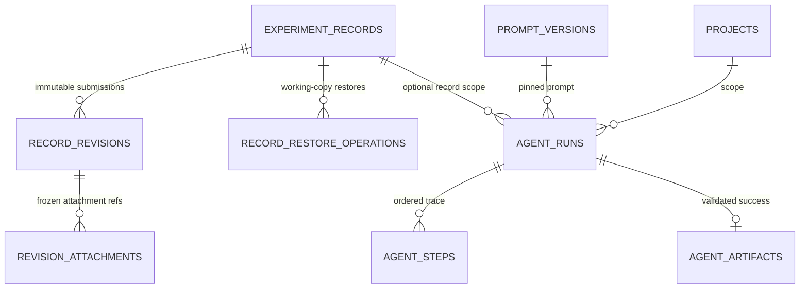
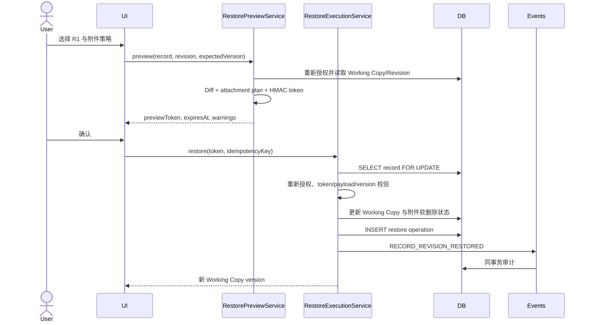
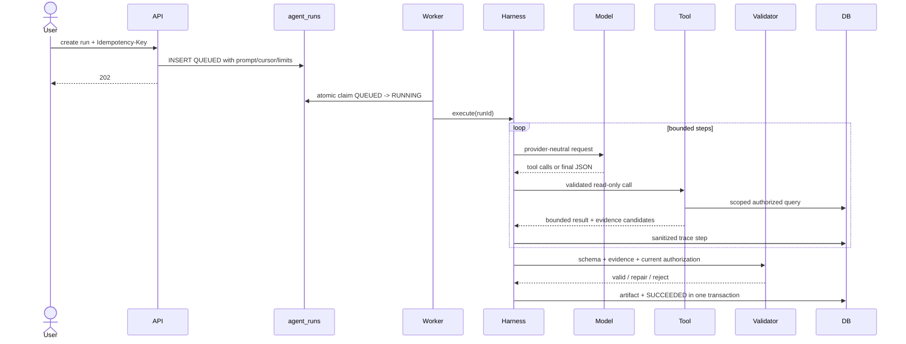
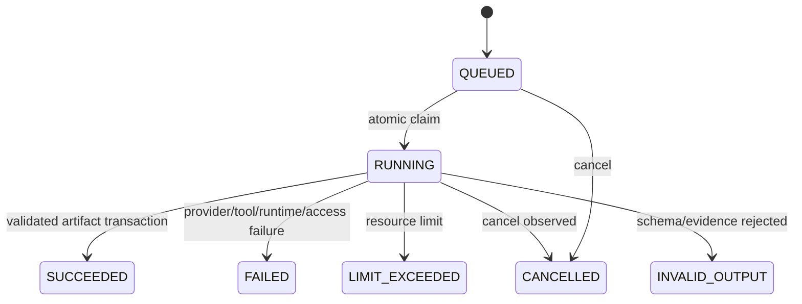

# 第二阶段架构说明

## 组件

```mermaid
flowchart LR
  UI["React contextual UI"] --> API["Spring REST controllers"]
  API --> Policy["RecordActionPolicy / object authorization"]
  API --> Revision["Revision query + domain Diff"]
  API --> Restore["Restore preview + execution"]
  API --> RunAPI["Agent Run API"]
  RunAPI --> Queue[("agent_runs DB queue")]
  Worker["AgentRunWorker"] --> Queue
  Worker --> Harness["AgentHarness"]
  Harness --> Model["AgentModelClient: fake or OpenAI-compatible"]
  Harness --> Registry["Read-only ToolRegistry"]
  Registry --> ReadModels["BioNote read models"]
  Harness --> Validator["JSON Schema + Evidence Validator"]
  Harness --> Trace[("agent_steps")]
  Validator --> Artifact[("agent_artifacts")]
  Revision --> DB[("MySQL / H2")]
  Restore --> DB
  ReadModels --> DB
  Restore --> Events["Typed events + audit"]
  Artifact --> Events
```

Controller 只做协议转换。权限、状态、事务、幂等和乐观锁位于 service/domain 层。

## 数据模型

`record_revisions` 是用户历史版本的唯一事实源；`record.version` 仅是 Working Copy 乐观锁。`agent_artifacts` 是派生报告，不是项目事实表。

## Restore 时序

任何一步失败均回滚；R1/R2、Revision attachments、Review 与审核结论不变。

## Agent Run 时序

取消在循环开头、模型响应后和 Artifact 持久化行锁事务内检查。失败、取消、超时、limit 或 invalid output 均不产生 Artifact。

## 权限矩阵

| 能力                      |             记录创建者 |      项目 OWNER |     REVIEWER |       MEMBER | outsider |
| ------------------------- | ---------------------: | --------------: | -----------: | -----------: | -------: |
| 查看同项目 Revision/Diff  |                     是 |              是 |           是 |           是 |       否 |
| Restore 可编辑记录        |               自己创建 |      仅自己创建 |   仅自己创建 |   仅自己创建 |       否 |
| Restore 完成记录/归档项目 |                     否 |              否 |           否 |           否 |       否 |
| 创建 Record Summary       |               自己创建 |      仅自己创建 |   仅自己创建 |   仅自己创建 |       否 |
| 创建 Project Progress     |             若为 OWNER |              是 |           否 |           否 |       否 |
| 查看项目 Artifact         |                     是 |              是 |           是 |           是 |       否 |
| 查看 Trace                |                 请求者 |              是 | 仅自己的 Run | 仅自己的 Run |       否 |
| cancel/rerun              | 请求者；rerun 重验权限 | OWNER 可 cancel |   按创建权限 |   按创建权限 |       否 |

所有写操作和工具调用均在执行时重新授权；创建 Run 后失权会失败且不保存 Artifact。

## 状态机

记录状态机继续沿用第一阶段：`IN_PROGRESS -> IN_REVIEW -> CHANGES_REQUESTED -> IN_REVIEW -> COMPLETED`。Restore 只允许 `IN_PROGRESS` 或 `CHANGES_REQUESTED`，并保持原状态。

## 性能与 V12

真实 MySQL EXPLAIN 显示 Revision list、Worker claim 和 Run steps 已命中 V9/V11 索引；Restore history 与跨 kind Artifact list 原有索引会 filesort。V12 新增：

- `(record_id, restored_at DESC, id DESC)`
- `(project_id, created_at DESC, id DESC)`
- `(record_id, created_at DESC, id DESC)`

V12 后三类计划均命中新索引并消除 filesort。

## 测试金字塔

- 单元：状态策略、Normalizer/Diff、HMAC token、Tool registry、Trace 脱敏、前端组件。
- 集成：权限、恢复事务/并发/审计回滚、双 Worker、provider/tool/artifact failure、Evidence、Demo 完整性。
- E2E：第一阶段审核与附件回归、Revision/Diff/Restore、权限、Agent 成功/失败、Evidence/Trace/Replay。
