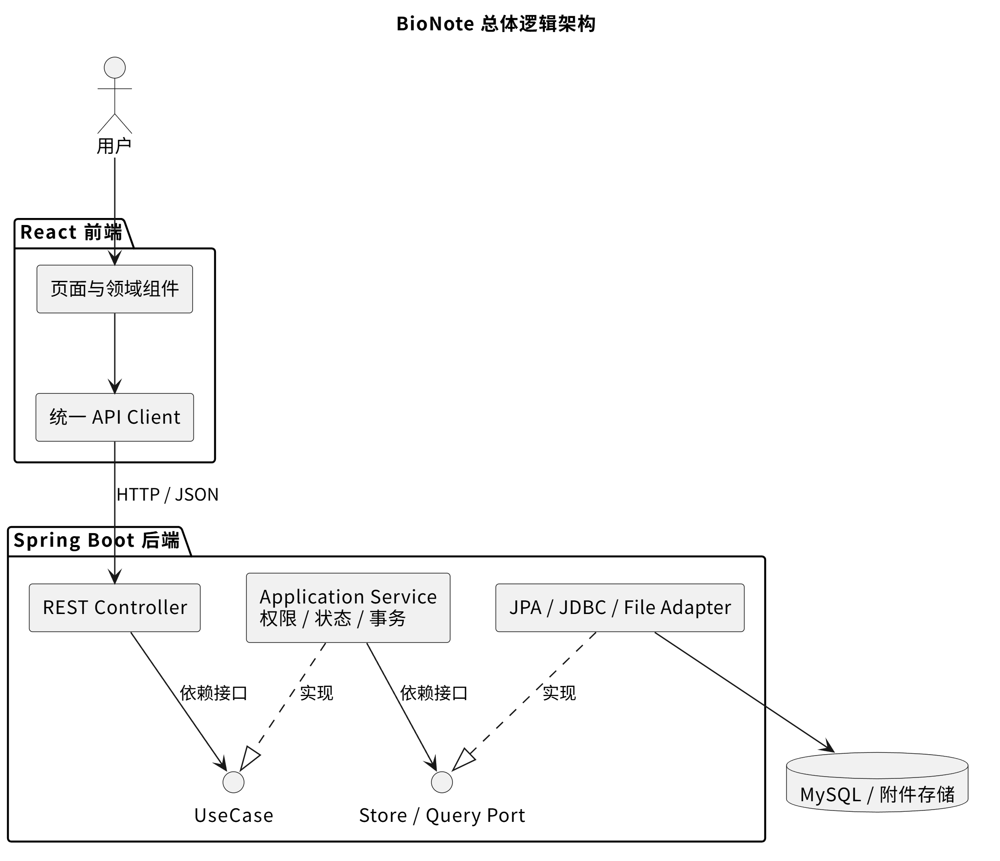
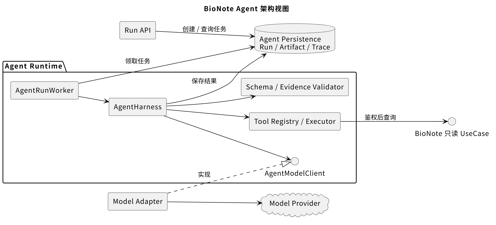
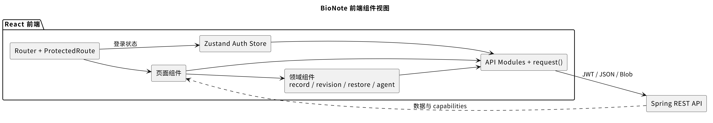
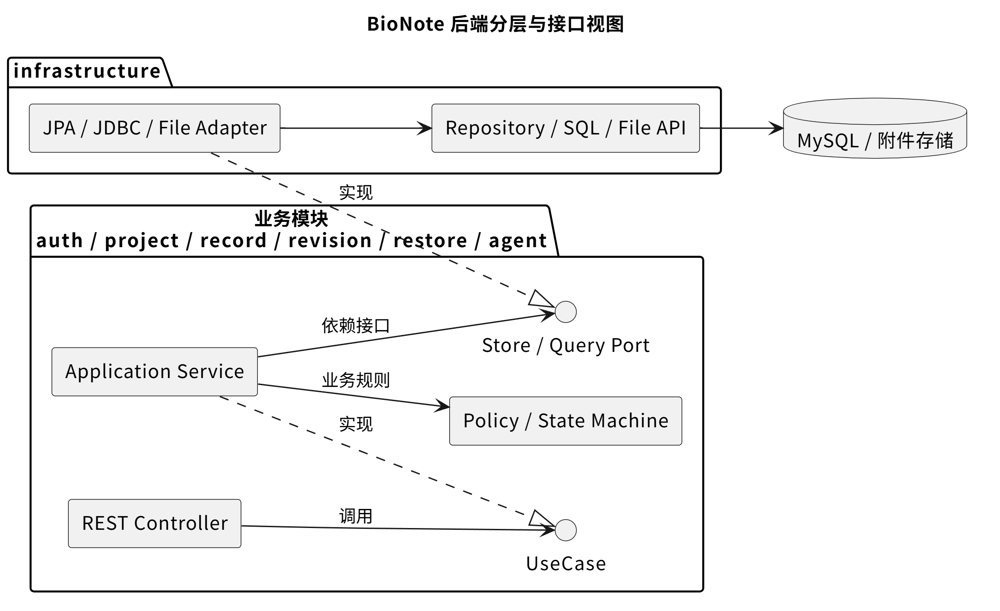

## 1. 项目来源与需求工程

### 1.1 项目灵感

项目来源于与友校一名生物专业同学的合作：

- 对方提供真实实验场景、业务想法、实验数据和迭代反馈。
- 开发团队负责需求分析、产品设计、技术实现、测试和交付。
- 每轮迭代后，由真实使用者从设计思路和使用体验两个角度提出修改意见。

### 1.2 需求分析

在高校学生实验、课程设计和初级科研训练场景中，实验记录存在以下问题：

- 实验资料分散在 Word、聊天软件、本地文件夹中，难以统一组织。
- 学生记录格式不统一，容易遗漏实验目的、过程、结果等关键信息。
- 小组成员之间缺少清晰的职责、审核和修改追溯机制。
- 已完成实验难以搜索、复用和整理成报告。

### 1.3 竞品研究

我们系统研究了专业工具Benchling。

Benchling 的优势：

- 以 Project 和 Notebook Entry 组织实验资料。
- 对生命科学领域适配度高。
- 强调模板、权限、团队协作和数据追踪。
- 具有成熟的版本管理和审计思想。

对简单教学实验的不足：

- 功能复杂，初学者学习成本较高。
- 企业级和专业科研能力较重。
- 部分能力依赖付费或机构账号。
- 中文和国内教学实验并非其主要目标。

(备注：我们系统研究了专业工具benchling，分析出它在版本管理和审计追踪上的优势，也发现它对本科教学实验来说太过复杂。因此，我们针对课程实践场景做了取舍和创新，最终定位为一个轻量、可复现、支持结构化模板的生物实验记录助手。)

### 1.4 产品定位

一款面向高校学生实验、课程设计和初级科研训练的轻量化电子实验记录助手

## 2. 项目介绍

### 2.1 主要功能

- 项目协作：创建项目、邀请成员、分配负责人和审核人，实现多人协作。
- 实验记录：使用结构化模板和富文本编辑器记录实验过程，支持附件、自动保存、搜索与导出。
- 审核流程：实验记录可提交审核、退回修改和审核通过，并通过状态机控制编辑权限。
- 版本管理：自动保存不可变历史版本，支持版本时间线、内容 Diff 和历史版本恢复。
- 安全与审计：提供角色权限、对象级访问控制、操作日志和并发冲突保护。
- 智能辅助：Agent 可通过只读工具查询项目数据，生成带证据、可追踪和可复核的分析结果。
- 数据分析扩展：支持读取 CSV/Excel 数据，进行曲线拟合、多元回归和图表展示。

### 2.2 产品特色

#### 2.2.1. 权限、审核与状态机结合

系统通过综合考虑用户角色、项目成员关系、记录状态和操作类型来判断权限。

实验记录按照状态机流转：

`编辑中 → 审核中 → 退回修改 / 审核通过`

- 编辑中：记录创建者可以修改内容。
- 审核中：内容和附件被冻结，避免审核期间被修改。
- 退回修改：创建者根据审核意见继续完善。
- 审核通过：记录永久只读，形成稳定的实验成果。
- 项目负责人可以管理项目，但不能随意修改其他成员的实验记录。
- 只有指定审核人才能给出审核结论。

将权限控制与业务状态深度结合，明确记录责任，从而保证实验记录的责任边界和审核可信度。

---

#### 2.2.2. Git 风格的时间线、版本管理与 Diff

系统借鉴 Git 的版本治理思想，针对实验记录场景进行了领域化设计。

- 每次提交或恢复都会生成不可变的 Revision，历史版本不会被覆盖。
- 项目时间线聚合记录创建、提交审核、审核结果、版本恢复和 Agent 分析等关键事件。
- 用户可以比较任意两个历史版本。
- Diff 不只比较普通文本，还能识别标题、结构化字段、富文本正文块和附件的新增、删除与修改。
- 恢复历史版本时，系统先展示恢复预览和差异，用户确认后修改当前工作副本，而不是删除后续历史。

因此，它能够记录修改历史、修改内容，并提供安全恢复，增强了实验过程的可追溯性和可复现性。

---

#### 2.2.3. Agent Harness 框架

参考 Tool Use Agent 模式，设计了一套受约束、可追踪的 Agent 运行框架。

- Tool：Agent 只能调用经过注册和验证的白名单只读工具。
- Authorization：每次工具调用都会重新校验当前用户的访问权限，防止越权查询。
- Schema：工具参数和最终输出必须满足预定义的数据结构。
- Evidence：Agent 的关键结论必须引用系统中真实存在的项目、记录或审核数据。
- Trace：记录模型调用、工具调用、执行步骤、耗时和失败原因。
- Replay：支持回放执行过程，便于调试、复核和审计。
- Runtime：通过数据库任务队列、Worker、超时、步骤数和 Token 限额控制运行过程。

这一框架把不可控的大模型限制在可授权、可验证、可追踪的工程边界内，使 Agent 的回答有数据依据，执行过程可以复核。

在此基础上，系统进一步添加了实验数据拟合工具库。用户可以要求 Agent 分析 CSV、Excel 或实验记录中的数据，支持线性、多项式、指数、对数、幂函数、米氏和 Logistic 等拟合模型，自动生成可视化图表，简化实验者的工作任务。

### 2.3 软件架构

#### 2.3.1 逻辑架构

BioNote 采用前后端分离的模块化架构：
- 前端：React，负责页面展示、交互状态和用户体验。
- 后端：Spring Boot，负责业务规则、权限、安全、事务和数据访问。
- 数据库：MySQL，使用 Flyway 管理数据库迁移。
- Agent Runtime：作为后端中的独立业务模块，负责任务调度、工具调用、模型适配等。
- 外部模型：通过统一接口接入 OpenAI-compatible Provider。

~~~
React 页面和组件
        │
统一 API Client / JWT / 错误处理
        │
Spring REST Controller
        │ 只依赖接口
UseCase 接口
        │
Application Service
 ├─ Policy / State Machine
 ├─ Transaction / Idempotency
 └─ Domain Event
        │
Store / Query Port 接口
        │
JPA / JDBC / File / Model Adapter
        │
MySQL / 文件系统 / Model Provider
~~~

Agent 部分：
~~~
Run API
  → agent_runs 数据库队列
  → AgentRunWorker
  → AgentHarness
      ├─ Planner
      ├─ ModelClient
      ├─ Tool Registry / Executor
      ├─ Validator
      └─ Trace Recorder
  → Artifact
~~~

总体逻辑架构视图：

Agent 架构视图：

#### 2.3.2 前端

- React Router 管理页面和受保护路由。
- 页面组件负责完整业务流程编排。
- components 按 record、revision、restore、agent、timeline 等领域拆分。
- api 目录统一封装路径、Token、错误、Blob 和 Idempotency-Key。
- Zustand 只保存认证和轻量状态，不复制全部服务端业务数据。
- 搜索条件、详情 Tab、Diff 来源和 Agent 项目上下文保存在 URL 中。
- Revision 和 Agent 等较重组件使用 lazy loading。
- 后端返回 capabilities，前端不自行复制复杂权限规则。

前端组件视图：

#### 2.3.3 后端

- Java 17、Spring Boot 3.2。
- 按 auth、project、record、revision、restore、agent 等业务包组织。
- Controller 负责 HTTP 协议转换。
- UseCase 表达应用入口。
- Service 承担权限、状态、事务和业务规则。
- Store/Repository Port 隔离持久化。
- infrastructure 内实现 JPA、JDBC、文件和外部 Provider Adapter。
- Flyway V1—V15 管理数据库演化。

后端接口与适配器视图：

### 2.4 基于接口的设计

#### 2.4.1 输入接口：Controller 依赖 UseCase

Controller 不直接编写复杂业务逻辑，而是依赖 UseCase 接口。
例如实验记录模块：
RecordController
      ↓
RecordUseCase
      ↓
RecordService
其中：
Controller 负责接收 HTTP 请求、校验请求格式和返回响应。
RecordUseCase 定义系统能够提供的业务操作。
RecordService 实现具体业务流程。
权限、状态转换和事务规则在业务层完成，而不是散落在 Controller 中。

#### 2.4.2 输出接口：业务层通过 Port 访问外部资源
业务层不会直接操作 JPA Repository，而是通过业务接口访问数据。
例如：
RecordService
    ↓
RecordStore
    ↓
JpaRecordStore
    ↓
Spring Data JPA Repository
这里：
RecordStore 是业务层定义的持久化接口。
JpaRecordStore 是基础设施层提供的实现。
Spring Data JPA 和数据库表结构被封装在 Adapter 内部。

#### 2.4.3 Agent 中的接口设计

Agent Runtime
   ├─ AgentModelClient
   │    ├─ FakeAgentModelClient
   │    └─ OpenAiCompatibleModelClient
   │
   ├─ AgentTool
   │    ├─ 项目查询工具
   │    ├─ 记录查询工具
   │    ├─ 审核查询工具
   │    └─ 数据分析工具
   │
   └─ AgentResultValidator
        └─ JsonSchemaArtifactValidator
             └─ EvidenceValidator

这一设计是合理的：AgentModelClient 使用策略与适配器隔离模型供应商，AgentTool<I,O> 作为工具扩展 SPI，由 AgentToolRegistry 自动发现和校验只读工具；AgentResultValidator 则把 Harness 与具体的 Schema、Evidence 校验逻辑解耦。新增模型、工具或验证器时，不需要修改 Harness 主循环。

### 2.5 设计模式

#### 2.5.1 适配器模式 Adapter

项目中的典型结构： 

业务接口 RecordStore
        ↑
   JpaRecordStore
        ↓
JPA Repository / MySQL

我们使用适配器模式隔离数据库和外部模型。核心业务只定义自己需要的接口，JPA、JDBC 和模型 Provider 在基础设施层实现这些接口，使技术实现可以替换而不影响业务逻辑。

#### 2.5.2 状态模式思想 State Machine

系统将实验记录的生命周期建模为明确的状态机：

IN_PROGRESS
    ↓ 提交审核
IN_REVIEW
    ├─ 退回 → CHANGES_REQUESTED
    └─ 通过 → COMPLETED

不同状态具有不同的操作规则：
IN_PROGRESS：创建者可以编辑。
IN_REVIEW：内容和附件被冻结。
CHANGES_REQUESTED：创建者可以根据意见继续修改。
COMPLETED：记录永久只读。
只有指定审核人可以审核当前 Revision。

这些规则集中在 RecordActionPolicy 中，由它综合判断：
用户角色
  × 项目成员关系
  × 记录状态
  × 是否创建者
  × 操作类型
  → 是否允许操作

Controller 和前端页面不需要分别编写大量权限判断，而是由后端 Policy 集中处理角色、状态和操作之间的权限关系。

### 2.6 关键技术

项目的技术亮点不在于简单组合 React、Spring Boot 和大模型，而在于把实验协作中的权限、版本、并发和 AI 不确定性转化为可执行、可验证的工程机制。核心质量目标是：**边界可维护、操作可授权、历史可追溯、写入强一致、AI 结果有依据。**

#### 2.6.1 可执行的模块边界与前后端契约

项目采用按业务领域拆分的模块化单体。选择单体不是为了省略架构设计，而是为了在课程项目规模下保留审核、恢复和审计所需要的本地事务，同时通过接口维持清晰边界。

- **后端依赖倒置**：Controller 只依赖 UseCase 接口；Application Service 组合 Policy、状态机和事务；数据访问通过 Store/Query Port 完成；JPA、JDBC、文件存储和模型 Provider 均封装在 `infrastructure` Adapter 中。
- **架构规则自动化**：`LayerDependencyTest` 持续检查 Controller 字段必须是接口、业务代码不得依赖 `infrastructure`、SQL 与 Spring Data 依赖只能出现在基础设施层。分层因此不是口头约定，而是会随测试失败的架构约束。
- **前端按职责拆分**：Router 管理受保护路由，Page 编排完整业务流程，Component 按 record、revision、restore、agent、timeline 等领域组织，`api` 目录统一处理路径、JWT、错误、Blob、超时和幂等请求头。
- **服务端状态是事实源**：Zustand 只保存认证等轻量状态，不在浏览器复制整套业务数据；搜索条件、详情 Tab、Diff 来源和 Agent 项目上下文放入 URL，使页面刷新、返回和链接分享后仍能恢复关键上下文。
- **面向重交互的加载策略**：Revision、PDF 和 Agent 面板按需懒加载；异步 Agent 使用逐步退避轮询并在终态或组件卸载时停止，兼顾响应速度与请求成本。

这套结构的价值是让一次需求变更通常只穿过“页面/组件 → API 契约 → UseCase → Port/Adapter”这条稳定路径，并由自动化测试防止模块边界在迭代中退化。

#### 2.6.2 Policy、状态机与对象级授权

系统将“已经登录”和“有权操作这个具体对象”分开处理。Spring Security 使用无状态 JWT 恢复请求身份，密码使用 BCrypt 存储；Controller 只接受 SecurityContext 中的用户 ID，不信任客户端提交的 `actorId`。

真正的授权由后端根据业务上下文计算：

~~~text
JWT 身份
  + 项目成员角色
  + 记录创建者 / 指定审核人
  + 项目与记录状态
  + 当前操作类型
  → RecordActionPolicy / Service 决策
  → capabilities 或统一错误
~~~

- **角色与对象同时约束**：OWNER、MEMBER、REVIEWER 提供角色边界；项目成员关系、资源所有权和 `reviewerId` 继续限制具体对象，防止同角色用户横向访问其他项目或修改他人记录。
- **状态决定可执行动作**：记录只允许 `IN_PROGRESS / CHANGES_REQUESTED → IN_REVIEW → CHANGES_REQUESTED / COMPLETED`。审核期间冻结内容和附件，完成后永久只读；只有记录创建者能编辑，只有当前指定审核人能作出审核结论。
- **前端只展示能力，不承担授权**：后端返回 `canEdit`、`canSubmit`、`canRestore` 等 capabilities，前端据此呈现操作入口；每次 API 调用仍重新授权，修改页面状态或伪造请求不能绕过规则。
- **减少信息泄露**：对不可见资源使用统一的“资源不存在或无权访问”语义，避免通过枚举 ID 探测其他项目数据。

这一设计不是单纯 RBAC，而是 **RBAC + 对象级 Policy + 业务状态机**，把协作责任和数据安全落实到每一次操作。

#### 2.6.3 Working Copy、不可变 Revision 与领域 Diff

系统将持续编辑的 Working Copy 与审核、追溯使用的不可变 Revision 分离：自动保存只更新工作副本，提交审核才固化 R1、R2 等 Revision，因此每条审核意见始终指向确定内容。

- **语义快照**：`SnapshotNormalizer` 将固定字段、模板字段、TipTap 正文块、附件和审核元数据整理为稳定结构；模板结构也随 Revision 保存，后续修改模板不会改变历史版本的含义。
- **规范化与内容指纹**：数字、日期、换行和空白等先规范化，再按稳定顺序序列化并计算 SHA-256 canonical hash，用于判断真实变化和识别过期恢复预览。
- **领域感知 Diff**：固定字段和模板字段按 Key 对齐，附件按 UUID 做集合比较，富文本按“块类型 + 顺序 + 文本”比较，返回 ADDED、REMOVED、MODIFIED、UNCHANGED，而不是把整份 JSON 当作字符串。
- **块内文本算法**：多行字段和正文块内部使用 Token 级 LCS 生成 EQUAL、INSERT、DELETE hunk；对超大输入限制文本、矩阵规模、hunk 和 section 数量，必要时确定性降级并返回 `truncated` 与 warning，避免 Diff 本身耗尽资源。
- **单一能力复用**：同一 `RevisionDiffUseCase` 支持 Revision/Revision 与 Revision/Working Copy，也被恢复流程和 Agent 工具复用，避免多套比较逻辑产生不同结论。

~~~text
Revision / Working Copy
  → 规范化 Snapshot + canonical hash
  → 字段 Key / 附件 UUID / 富文本块匹配
  → 块内 LCS 文本 Diff
  → Summary + Sections + Warnings
~~~

因此系统回答的不是“两个 JSON 是否不同”，而是“哪个实验字段、哪段正文、哪些附件发生了什么变化”，更符合实验复核和可复现需求。

#### 2.6.4 两阶段恢复与并发一致性

恢复历史版本是高风险写操作。系统把它设计为 Preview 和 Execute 两阶段，并明确规定：**恢复不是删除历史，而是用历史 Revision 重建新的 Working Copy。**

- **Preview**：重新鉴权并校验 `expectedRecordVersion`，计算领域 Diff 和附件激活、保留、软删除计划，提前报告物理文件缺失等风险；随后签发 5 分钟有效的 HMAC-SHA256 Token，绑定用户、项目、记录、来源 Revision、附件策略、版本、前后内容 Hash、过期时间和 nonce。
- **用户确认**：前端展示内容变更摘要与附件计划；切换附件策略会重新生成预览，过期或冲突后只能刷新预览再执行。
- **Execute**：验证 Token 及全部绑定参数，获取记录数据库行锁，重新授权，并再次检查版本与两侧 canonical hash。预览后只要工作副本发生变化，恢复就会被拒绝，从而避免“看见 A、实际覆盖 B”。
- **幂等与事务**：`Idempotency-Key` 与 Payload Hash 一同保存；相同请求重试返回原结果，同 Key 对应不同请求则报冲突。Working Copy、附件状态、Restore Operation、领域事件和事务型审计在同一事务中完成，任一步失败都整体回滚。
- **审计链不被破坏**：已有 Revision、附件快照和审核结论保持不变；恢复后的内容只有再次提交时才形成新的 Revision。

该方案同时覆盖了误操作、重复点击、请求重放、并发覆盖和附件状态不一致，而不是只实现一个“把旧 JSON 写回来”的接口。

#### 2.6.5 受约束、可追踪的 Agent Runtime

系统没有让大模型直接连接数据库，而是用 `AgentHarness` 把模型包围在授权、预算、验证和审计边界内。

~~~text
Run API → agent_runs 数据库队列 → Worker → AgentHarness
                                           ├─ ModelClient
                                           ├─ Tool Registry / Executor
                                           ├─ Schema / Evidence Validator
                                           └─ Trace Recorder
                                                  ↓
                                        Artifact + SUCCEEDED
~~~

- **异步执行与状态机**：API 创建 QUEUED 任务后立即返回，Worker 原子领取任务；状态只能按 QUEUED、RUNNING 和五种终态合法迁移，模型调用不会长期占用 HTTP 请求。
- **模型与业务解耦**：`AgentModelClient` 提供统一接口，Fake Provider 支持离线确定性测试，OpenAI-compatible Adapter 接入真实模型，Harness 主循环不依赖具体厂商。
- **最小权限工具系统**：`AgentTool` SPI 与 Registry 只注册通过校验的 READ_ONLY 工具；每次调用都经过 Prompt 白名单、参数 Schema/Bean Validation、输出边界和当前用户对象级授权，模型不能覆盖服务端注入的 actor、project、record 上下文。
- **资源预算与明确失败**：总时长、模型次数、步骤数、工具次数和修复轮次均有上限，相同工具参数可命中 Run 内缓存；取消、超时、未知工具、非法参数和超限都有独立状态，不会包装成成功。
- **Schema + Evidence 双重校验**：最终 JSON 先验证结构，再验证关键结论引用的 Project、Record、Revision 或 Review 是否真实、可访问。校验失败只允许有限次修复，仍不合法则不生成 Artifact。
- **Trace 与原子成功**：Trace 只保存经过裁剪、白名单和脱敏的请求/结果摘要、耗时与 Token，不保存隐藏推理；Artifact 写入与 Run 置为 SUCCEEDED 在同一事务完成，避免“状态成功但报告不存在”。
- **前端可观察性**：界面采用退避轮询展示状态，支持取消、重跑、Evidence 跳转与 Trace Replay；Replay 只展开后端已保存的脱敏步骤，不会再次调用模型或工具。

该框架不能消除模型的不确定性，但能保证模型“只能读取有权数据、必须给出可核验证据、失败时不产生伪成功、全过程可以复核”。

#### 2.6.6 模型理解意图，确定性引擎负责计算

数据拟合扩展将自然语言理解与数值计算分开，避免把大模型当作不可验证的“计算器”。

- **意图结构化**：`FitIntentParser` 与 `FitProposalResolver` 结合自然语言、CSV/Excel 文件名和表头，提取数据来源、x/y 列、筛选条件、拟合方程及是否自动比选；模型解析不可用时仍可回退到确定性规则。
- **受控数据提取**：`PointExtractor` 负责读取 CSV/Excel、转换数值和时间列、过滤非法点并记录跳过原因；读取项目记录和附件前仍执行成员权限检查。
- **确定性数学引擎**：预置线性、二次、三次、指数、对数、幂函数、米氏和 Logistic 等模型，也支持受限自定义单变量方程；多元场景使用 OLS，并检测常数列、样本不足和共线性。
- **可比较的计算结果**：参数、R²、RMSE、样本数、观测点和拟合曲线均由后端计算。自动比选先按 R²、再按 RMSE 选择结果，同时返回候选模型比较信息。
- **结构化展示**：数值卡片和图表直接消费后端 Fit Result，而不是从模型回答文本中提取数字；前端 `DataChart` 展示观测点、拟合曲线和放大视图。

这一设计把生成式 AI 放在它擅长的语义理解和解释环节，把数值正确性留给可单元测试、可重复执行的数学引擎。

### 2.7 测试与质量控制

项目建立了覆盖需求、代码、接口、系统和用户体验的多层质量保证体系。
软件评审：每轮迭代后，从 UI 交互、业务逻辑和用户体验等方面开展评审，并结合真实用户反馈持续改进，保证需求的正确性和完整性。

单元、组件与集成测试：后端使用 JUnit/Spring Boot Test，覆盖领域策略、Service、持久化适配器、事务和 API 集成；前端采用 Vitest、Testing Library 和 jsdom，验证组件渲染、交互、页面流程和状态边界。

API 与架构测试：前端通过拦截 fetch 验证请求构造、响应解析、认证和异常处理；后端 LayerDependencyTest 自动检查 Controller 只依赖接口、业务层不依赖 infrastructure、SQL 不越过基础设施边界。

系统测试：使用 Playwright 编写 8 个 E2E Spec，覆盖认证授权、审核流程、并发冲突、幂等控制、版本 Diff 与恢复，以及 Agent 的执行与失败处理。

兼容性与界面测试：验证 Chrome、Firefox、Edge 等浏览器环境，并通过自动化测试和人工评审检查界面渲染、富文本编辑、附件预览、视觉一致性和错误提示。

## 3. 项目管理

### 3.1 团队协同

项目初期由于经验不足，曾出现文档粒度不一致、任务边界重叠和集中集成时冲突较多的问题。复盘后，团队形成了以下协同方式：

- 采用增量迭代，每轮交付可运行版本，并将真实用户反馈进入下一轮 Backlog。
- 从功能清单转向 WBS 和依赖关系，先明确公共 DTO、状态、错误码、API 和数据库迁移，再并行实现，即 Contract-first。
- 对高冲突文件和业务模块设置主负责人，实行“单一合并责任、多人共同评审”，并按依赖顺序小步合并。
- 将实现、接口/迁移、测试、演示步骤和已知限制组成模块完成包，作为团队的 Definition of Done。

### 3.2 经验教训

- 真实需求必须通过可运行版本验证；用户看到实际流程后提出的反馈，通常比早期文字描述更准确。
- 协作问题不能只依靠“多沟通”，还需要稳定接口、明确所有权、依赖顺序和完成标准。
- 权限、恢复和 Agent 等高风险功能不仅要测试正常路径，还要覆盖越权、冲突、重复提交、超时和非法输出。
- 架构约束应尽量自动化，例如用架构测试防止分层边界在迭代中逐渐退化。

### 3.3 成员贡献

答辩前按真实姓名和人数调整下表，不建议只按代码行数或 Commit 数衡量贡献：

| 成员 | 主责问题/模块 | 核心交付物 | 质量与协作贡献 |
|---|---|---|---|
| 成员 A | 需求与基础业务 | 需求基线、项目/记录/审核闭环 | 用户反馈整理、业务集成测试 |
| 成员 B | Revision / Restore | Snapshot、Diff、Preview/Execute | 并发、幂等和回滚测试，契约评审 |
| 成员 C | Agent Harness | Model Client、Tool SPI、Worker、Artifact | 故障路径、Evidence/Trace 测试 |
| 成员 D | 前端与系统集成 | 编辑器、时间线、版本与 Agent UI | Vitest/Playwright、视觉一致性与演示 |

每位成员可用一句话陈述：“我负责解决什么问题，交付了什么结果，采用了什么关键设计，又通过什么测试或评审完成验证。”

